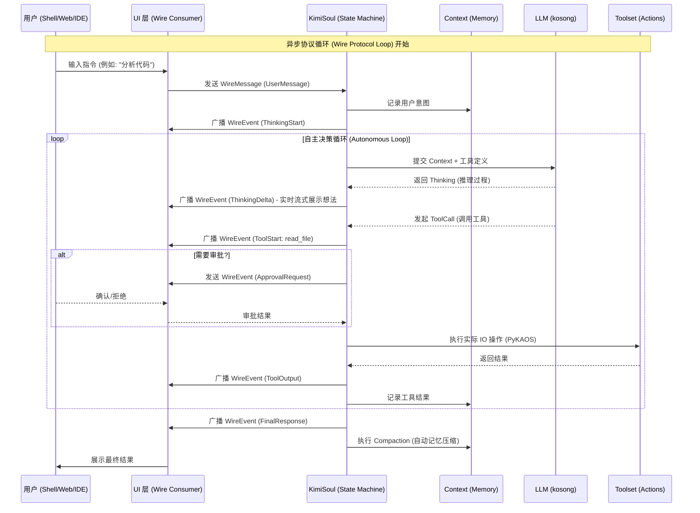

# Kimi Code CLI

## Quick commands (use uv)

- `make prepare` (sync deps for all workspace packages and install git hooks)
- `make format`
- `make check`
- `make test`
- `make ai-test`
- `make build` / `make build-bin`

If running tools directly, use `uv run ...`.

## Project overview

Kimi Code CLI is a Python CLI agent for software engineering workflows. It supports an interactive
shell UI, ACP server mode for IDE integrations, and MCP tool loading.

## Tech stack

- Python 3.12+ (tooling configured for 3.14)
- CLI framework: Typer
- Async runtime: asyncio
- LLM framework: kosong
- MCP integration: fastmcp
- Logging: loguru
- Package management/build: uv + uv_build; PyInstaller for binaries
- Tests: pytest + pytest-asyncio; lint/format: ruff; types: pyright + ty

## Architecture overview

- **CLI entry**: `src/kimi_cli/cli.py` (Typer) parses flags (UI mode, agent spec, config, MCP)
  and routes into `KimiCLI` in `src/kimi_cli/app.py`.
- **App/runtime setup**: `KimiCLI.create` loads config (`src/kimi_cli/config.py`), chooses a
  model/provider (`src/kimi_cli/llm.py`), builds a `Runtime` (`src/kimi_cli/soul/agent.py`),
  loads an agent spec, restores `Context`, then constructs `KimiSoul`.
- **Agent specs**: YAML under `src/kimi_cli/agents/` loaded by `src/kimi_cli/agentspec.py`.
  Specs can `extend` base agents, select tools by import path, and define fixed subagents.
  System prompts live alongside specs; builtin args include `KIMI_NOW`, `KIMI_WORK_DIR`,
  `KIMI_WORK_DIR_LS`, `KIMI_AGENTS_MD`, `KIMI_SKILLS` (this file is injected via
  `KIMI_AGENTS_MD`).
- **Tooling**: `src/kimi_cli/soul/toolset.py` loads tools by import path, injects dependencies,
  and runs tool calls. Built-in tools live in `src/kimi_cli/tools/` (shell, file, web, todo,
  multiagent, dmail, think). MCP tools are loaded via `fastmcp`; CLI management is in
  `src/kimi_cli/mcp.py` and stored in the share dir.
- **Subagents**: `LaborMarket` in `src/kimi_cli/soul/agent.py` manages fixed and dynamic
  subagents. The Task tool (`src/kimi_cli/tools/multiagent/`) spawns them.
- **Core loop**: `src/kimi_cli/soul/kimisoul.py` is the main agent loop. It accepts user input,
  handles slash commands (`src/kimi_cli/soul/slash.py`), appends to `Context`
  (`src/kimi_cli/soul/context.py`), calls the LLM (kosong), runs tools, and performs compaction
  (`src/kimi_cli/soul/compaction.py`) when needed.
- **Approvals**: `src/kimi_cli/soul/approval.py` mediates user approvals for tool actions; the
  soul forwards approval requests over `Wire` for UI handling.
- **Security & Safety**: `src/kimi_cli/soul/security.py` implements a blacklist for dangerous
  commands (e.g., `rm -rf /`, `mkfs`) and sensitive system paths (e.g., `~/.ssh`, `/etc/passwd`).
  The system uses a `FORCE_CONFIRM` mechanism to ensure manual user approval for high-risk
  actions, bypassing YOLO mode.
- **UI/Wire**: `src/kimi_cli/soul/run_soul` connects `KimiSoul` to a `Wire`
  (`src/kimi_cli/wire/`) so UI loops can stream events. UIs live in `src/kimi_cli/ui/`
  (shell/print/acp/wire).
- **Shell UI**: `src/kimi_cli/ui/shell/` handles interactive TUI input, shell command mode,
  and slash command autocomplete; it is the default interactive experience.
- **Slash commands**: Soul-level commands live in `src/kimi_cli/soul/slash.py`; shell-level
  commands live in `src/kimi_cli/ui/shell/slash.py`. The shell UI exposes both and dispatches
  based on the registry. Standard skills register `/skill:<skill-name>` and load `SKILL.md`
  as a user prompt; flow skills register `/flow:<skill-name>` and execute the embedded flow.
  Use `/reload-skills` to reload all skills and plugins from their roots without restarting.

# Kimi CLI Soul & Philosophy

This document defines the core identity, design philosophy, and execution model of Kimi CLI.

## Philosophy

Kimi Code CLI is built upon several core principles that guide its development and user experience:

1.  **Local-First & Transparent**: Designed for the terminal, prioritizing local execution and absolute user control. Every thought and action of the agent is visible via the `Wire` protocol, ensuring no "black box" behavior.
2.  **Modular & Declarative**: Agent behaviors are defined through declarative YAML specs. Capabilities are extended via a pluggable tool system (including MCP and Skills), allowing for easy composition and reuse.
3.  **Engineered for Reliability**: Rigorous type safety with Pyright and strict linting with Ruff. A robust `Approval` mechanism ensures that autonomous actions remain under human supervision.
4.  **Modern Developer Experience**: Leverages cutting-edge Python tooling (`uv`, `ruff`) and a workspace-based architecture to provide a fast, reproducible, and enjoyable development workflow.
5.  **Platform Agnostic Extensibility**: Abstracts OS interactions via `PyKAOS`, enabling seamless transitions between local and remote environments, while embracing the open MCP ecosystem.

## Core Architecture: The "Soul" vs. API Calls

Kimi CLI is not a simple wrapper around LLM API calls. It implements a **State Machine** driven by an **Asynchronous Protocol Loop (Wire Protocol)**.

### Why it's not a simple API call:

1.  **Statefulness**: The `Soul` maintains a persistent `Context` that evolves with every interaction, tool result, and background compaction.
2.  **Event-Driven (Wire)**: The `Soul` communicates via a stream of asynchronous events (`WireMessage`). This decouples the brain from the interface (Shell, Web, IDE).
3.  **Autonomous ReAct Loop**: The agent doesn't follow a pre-defined flow. It uses a `Reasoning -> Acting -> Observing` loop to decide its next move dynamically.
4.  **LaborMarket Integration**: Complex tasks trigger the `Task` tool, which spawns sub-agents from the `LaborMarket` via the `Wire` protocol.

### Async Protocol Loop (Mermaid)



## Implementation Map

- **Main Loop**: `src/kimi_cli/soul/kimisoul.py` (The logic that runs the loop above).
- **Tool Execution**: `src/kimi_cli/soul/toolset.py` (Bridges LLM calls to actual OS/Web actions).
- **Event Protocol**: `src/kimi_cli/wire/` (Definitions of all messages sent over the "Wire").
- **Memory Management**: `src/kimi_cli/soul/context.py` & `compaction.py`.
- **Operating System Abstraction**: `packages/kaos/` (Used by tools to interact with local/remote FS).

## Extension Methods

| Method | Description | Path |
| :--- | :--- | :--- |
| **Tools** | Pure Python functions decorated as tools. Fast and direct. | `src/kimi_cli/tools/` |
| **AgentSpecs** | YAML files that define a new "Persona" using existing tools. | `src/kimi_cli/agents/` |
| **Skills** | Markdown-based instruction sets (`SKILL.md`) that guide behavior. | `src/kimi_cli/skills/` |

## Major modules and interfaces

- `src/kimi_cli/app.py`: `KimiCLI.create(...)` and `KimiCLI.run(...)` are the main programmatic
  entrypoints; this is what UI layers use.
- `src/kimi_cli/soul/agent.py`: `Runtime` (config, session, builtins), `Agent` (system prompt +
  toolset), and `LaborMarket` (subagent registry).
- `src/kimi_cli/soul/kimisoul.py`: `KimiSoul.run(...)` is the loop boundary; it emits Wire
  messages and executes tools via `KimiToolset`.
- `src/kimi_cli/soul/context.py`: conversation history + checkpoints; used by DMail for
  checkpointed replies.
- `src/kimi_cli/soul/toolset.py`: load tools, run tool calls, bridge to MCP tools.
- `src/kimi_cli/ui/*`: shell/print/acp frontends; they consume `Wire` messages.
- `src/kimi_cli/wire/*`: event types and transport used between soul and UI.

## Repo map

- `src/kimi_cli/agents/`: built-in agent YAML specs and prompts
- `src/kimi_cli/prompts/`: shared prompt templates
- `src/kimi_cli/soul/`: core runtime/loop, context, compaction, approvals
- `src/kimi_cli/tools/`: built-in tools
- `src/kimi_cli/ui/`: UI frontends (shell/print/acp/wire)
- `src/kimi_cli/acp/`: ACP server components
- `packages/kosong/`, `packages/kaos/`: workspace deps
  + Kosong is an LLM abstraction layer designed for modern AI agent applications.
    It unifies message structures, asynchronous tool orchestration, and pluggable
    chat providers so you can build agents with ease and avoid vendor lock-in.
  + PyKAOS is a lightweight Python library providing an abstraction layer for agents
    to interact with operating systems. File operations and command executions via KAOS
    can be easily switched between local environment and remote systems over SSH.
- `tests/`, `tests_ai/`: test suites
- `klips`: Kimi Code CLI Improvement Proposals

## Conventions and quality

- Python >=3.12 (ty config uses 3.14); line length 100.
- Ruff handles lint + format (rules: E, F, UP, B, SIM, I); pyright + ty for type checks.
- Tests use pytest + pytest-asyncio; files are `tests/test_*.py`.
- CLI entry points: `kimi` / `kimi-cli` -> `src/kimi_cli/cli.py`.
- User config: `~/.kimi/config.toml`; logs, sessions, and MCP config live in `~/.kimi/`.

## Git commit messages

Conventional Commits format:

```
<type>(<scope>): <subject>
```

Allowed types:
`feat`, `fix`, `test`, `refactor`, `chore`, `style`, `docs`, `perf`, `build`, `ci`, `revert`.

## Versioning

The project follows a **minor-bump-only** versioning scheme (`MAJOR.MINOR.PATCH`):

- **Patch** version is always `0`. Never bump it.
- **Minor** version is bumped for any change: new features, improvements, bug fixes, etc.
- **Major** version is only changed by explicit manual decision; it stays unchanged during
  normal development.

Examples: `0.68.0` → `0.69.0` → `0.70.0`; never `0.68.1`.

This rule applies to all packages in the repo (root, `packages/*`, `sdks/*`) as well as release
and skill workflows.

## Release workflow

1. Ensure `main` is up to date (pull latest).
2. Create a release branch, e.g. `bump-0.68` or `bump-pykaos-0.5.3`.
3. Update `CHANGELOG.md`: rename `[Unreleased]` to `[0.68] - YYYY-MM-DD`.
4. Update `pyproject.toml` version.
5. Run `uv sync` to align `uv.lock`.
6. Commit the branch and open a PR.
7. Merge the PR, then switch back to `main` and pull latest.
8. Tag and push:
   - `git tag 0.68` or `git tag pykaos-0.5.3`
   - `git push --tags`
9. GitHub Actions handles the release after tags are pushed.

## Type Checking Notes

### `ty` (Type Checker) - Non-blocking Diagnostic Tool

- **Configuration**: Enabled in `Makefile` (all packages use `ty check || true`), making it non-blocking.
- **Status**: `make check` can pass even when `ty` reports diagnostics.
- **Version Policy**: pin `ty` to upstream baseline.
  - Current baseline: `ty==0.0.14` (aligned with `MoonshotAI/kimi-cli/main`).
  - Keep `pyproject.toml` and `uv.lock` in sync when bumping.

### Programming Rule: Suppression Comments

To avoid conflicts between Pyright and ty, use suppression comments by **tool namespace**:

1. **Pyright-only suppressions** must use:
   - `# pyright: ignore[reportXxx]`
   - Example: `# pyright: ignore[reportPrivateUsage]`

2. **Do not** use Pyright rule names in `# type: ignore[...]`.
   - Bad: `# type: ignore[reportMissingTypeStubs]`
   - This causes ty `unused-ignore-comment` diagnostics.

3. **`# type: ignore[...]`** is only for ty/typing-rule suppressions when truly needed.
   - Example: `# type: ignore[invalid-method-override]`, `# type: ignore[unresolved-reference]`

4. If one line needs both tools, keep both comments on the same line with clear ownership.

### Maintenance Notes

- **Linting (Ruff SIM102)**: Avoid nested `if` statements when they can be combined into a single `if` with `and`. This is a hard requirement for CI.
- **Tool Definitions & Snapshots**: When modifying tool schemas (e.g., `ask_user` tool `maxItems` or `description`), always run `uv run python -m pytest --inline-snapshot=fix` to synchronize the test snapshots in `tests/core/test_default_agent.py` and other relevant files.
- **Type Checking**: After any suppression update, run `make check` to verify:
  - Pyright remains green (blocking)
  - ty diagnostics are expected/non-blocking
- **Code Quality**: Prefer fixing types over adding suppressions.
